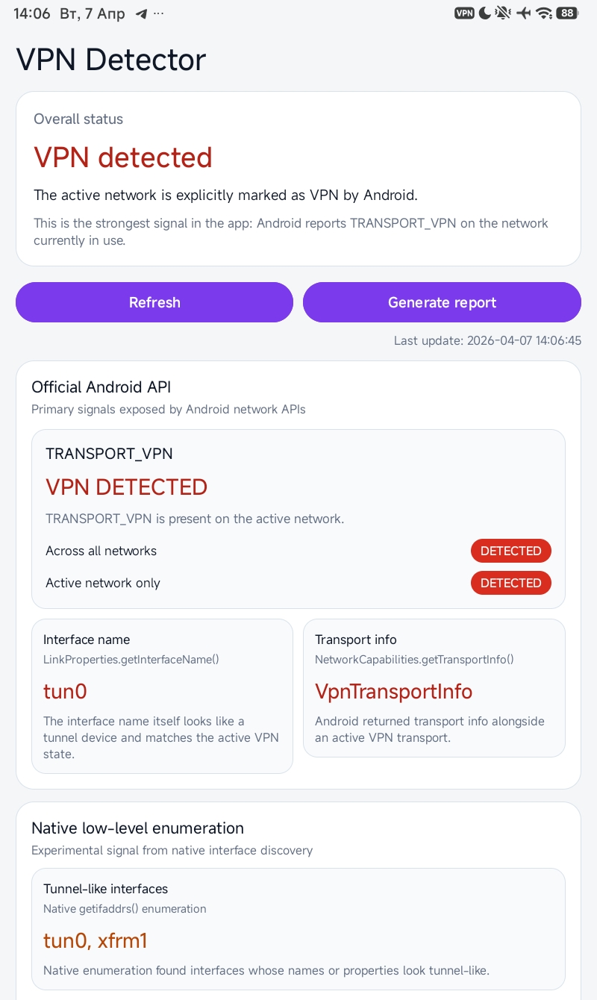
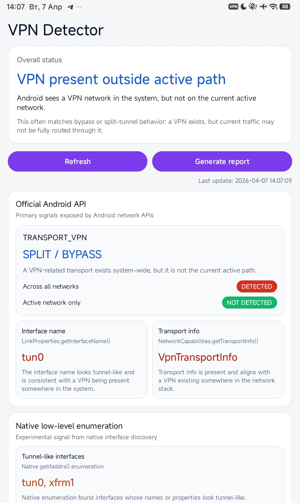

# Android VPN Detector

Research tool for analyzing VPN detection mechanisms on Android.

## Features
- Detect VPN via NetworkCapabilities.TRANSPORT_VPN
- Analyze active vs global VPN state
- Interface detection (tun0, wg0)
- Native + Java network enumeration

## Purpose
Demonstrates how apps can detect VPN presence even with split tunneling.

## Screenshots

**_VPN Active (full tunnel)_**

**_VPN Split / Bypass (still detectable)_**

